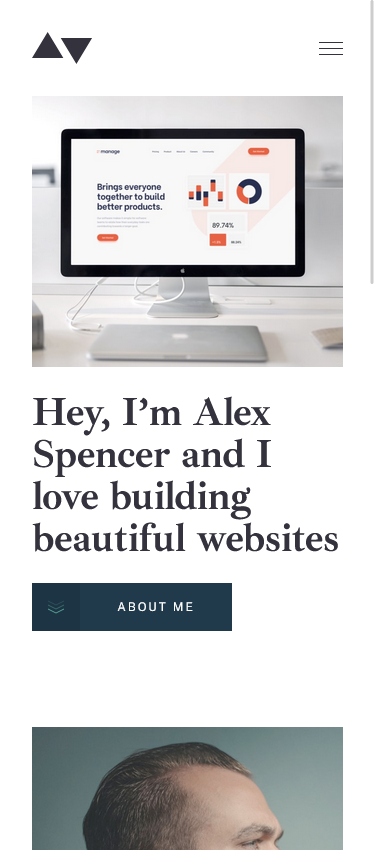
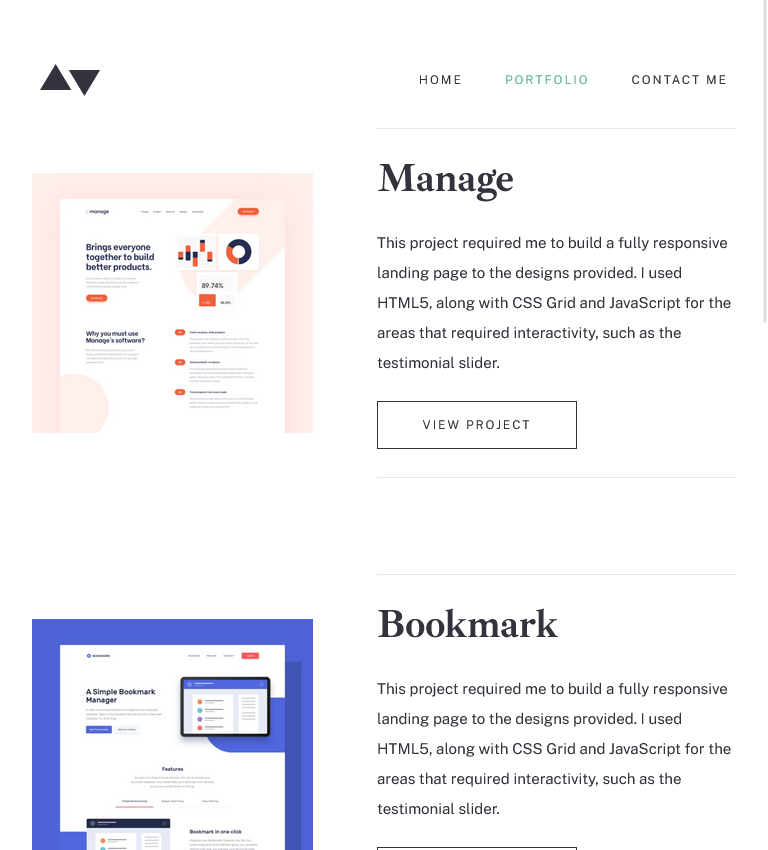
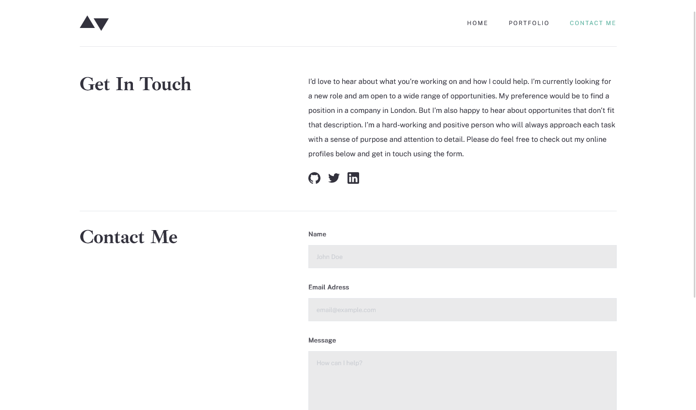

# Frontend Mentor - Minimalist portfolio website solution

This is a solution to the [Minimalist portfolio website challenge on Frontend Mentor](https://www.frontendmentor.io/challenges/minimalist-portfolio-website-LMy-ZRyiE). Frontend Mentor challenges help you improve your coding skills by building realistic projects.

## Table of contents

- [Overview](#overview)
  - [The challenge](#the-challenge)
  - [Screenshot](#screenshot)
  - [Links](#links)
- [My process](#my-process)
  - [Built with](#built-with)
  - [What I learned](#what-i-learned)
  - [Continued development](#continued-development)
- [Author](#author)
- [Acknowledgments](#acknowledgments)

## Overview

### The challenge

Users should be able to:

- View the optimal layout for each page depending on their device's screen size
- See hover states for all interactive elements throughout the site
- Click the "About Me" call-to-action on the homepage and have the screen scroll down to the next section

### Screenshot

#### Mobile View :

#### Tablet View :

#### Desktop View :

### Links

- [Solution URL](https://your-solution-url.com)
- [Live Site URL](https://your-live-site-url.com)

## My process

### Built with

- [Astro](https://astro.build/) - Astro is a new kind of static site builder that delivers lightning-fast performance with modern dev tools.
- [TailwindCSS](https://tailwindcss.com/) - For styles

### What I learned

- First time I used Astro, it was a good experience. I really liked the way it works. Looking forward to use it in future projects.

- Styling with tailwindCSS is fast, However Developer experience is not that good. Specially, when I left the project for a while and came back to it, I had a hard time figuring out what is going on in the code, and the HTML code looks awful with all the classes. I think I may consider going back to vanilla CSS with BEM convention for my next project.

- Planning before coding is a must. I had to change the HTML structure multiple times during the project, which was a waste of time. Having a kanban board with all the tasks would have been a better approach.

### Continued development

- Learning advanced Grid techniques. Mastering layout design is the key for a faster development.

- Learning more about semantic HTML.

- Learning more about accessibility.
- Learning about component animation and transitions for a better user experience.
- Writing a better README file.

## Author

- Frontend Mentor - [@Earthyyy](https://www.frontendmentor.io/profile/Earthyyy)
- Github - [@Earthyy](https://github.com/Earthyyy)

## Acknowledgments

Big Thanks <3 to :

- [Divize](https://divize.io/)
- [Kevin Powell](https://www.youtube.com/@KevinPowell)
- [Codecademy](https://www.codecademy.com)
- [Frontend Mentor](https://www.frontendmentor.io/)
